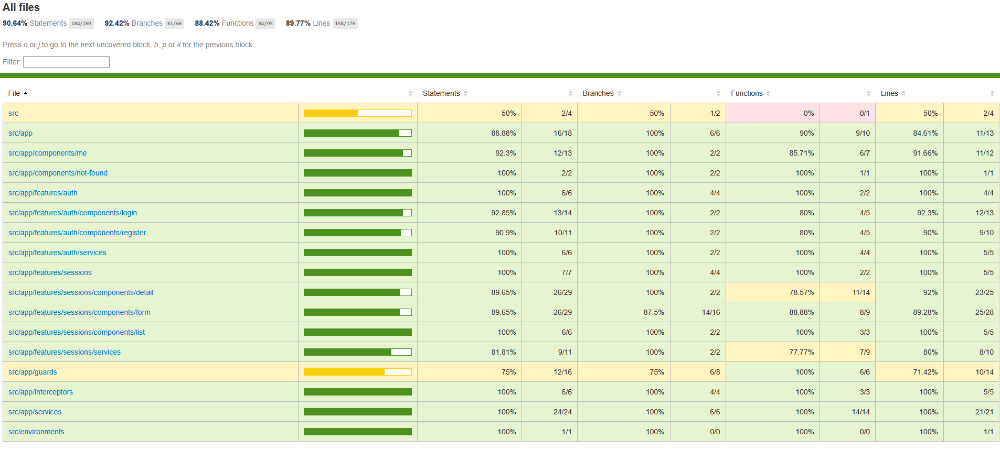

# Yoga App

Yoga App is a booking application for a Yoga studio.  
Administrators can create/update/delete sessions.  
Users, after registering, can list/view details/participate/unregister from a session.

1. [Description](#description)
2. [Installation and Setup](#installation-and-setup)
3. [Tests](#tests)
4. [Contribution and Contact](#contribution-and-contact)

# Description

The Backend is based on Java11 using the SpringBoot Framework.  
The Frontend uses Angular version 14.

Frontend tests:

- Jest for unit and integration tests
- Cypress for end-to-end tests

# Installation and Setup

## Prerequisites

- JDK 11
- Maven
- MySQL
- Node.js v16
- Npm 7.5.x
- Angular 14

## Install the application

### Clone the repository

```bash
git clone git@github.com:jceintrey/yoga-app.git
```

### Install dependencies

Go to the project folder

```bash
cd yoga-app
```

For the front

```bash
cd front
npm i
```

For the back

```bash
cd back
mvn clean install
```

If there is a database connection error, the build will fail. You can skip the database access tests and come back to them later.

### Install and prepare the database

## Running the application

1. The Backend must be started before the front.

```bash
cd back
mvn spring-boot:run
```

or from the package

2. For the Frontend,

```bash
cd front
npm run start
```

# Tests

The tests are mocked, and the Frontend and Backend tests can be done independently.

## Backend tests

## Frontend tests

⚠️ Jest and Cypress start the Frontend, so do not start it before running the tests.

### Unit and integration tests

```bash
cd front
npm run test
```

And for coverage

```bash
npm run test:coverage
```

The HTML coverage report is generated in front/coverage/jest/lcov-report/, access index.html.  
[Jest Coverage Report](ressources/screenshots/front-unit-itg-coverage.png)  
An HTML test report is also available here: front/reports/test-report.html

### End-to-end tests

```bash
cd front
npm run e2e:ci
```

And for the coverage report

```bash
npm run e2e:coverage
```

[Cypress Coverage Report](ressources/screenshots/front-e2e-coverage-report.png)

# Contribution and Contact

Yoga-app is a project offered by OpenClassrooms as part of the Full-stack Java Angular Developer track. If you want to contribute to the project:

- Fork the repository.
- Create a new branch for your feature (git checkout -b feature/feature-name).
- Commit your changes (git commit -m 'Add new feature').
- Push your changes to your fork (git push origin feature/feature-name).
- Open a Pull Request for review.

- GitHub: https://github.com/jceintrey/yoga-app
- Email: jeremie.ceintrey@gmail.com

# Screenshots

### Cypress E2E Coverage



### Jest ITG Unit Coverage


