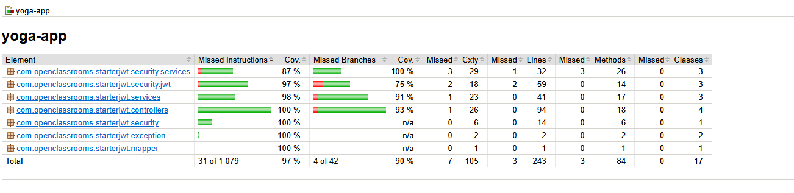
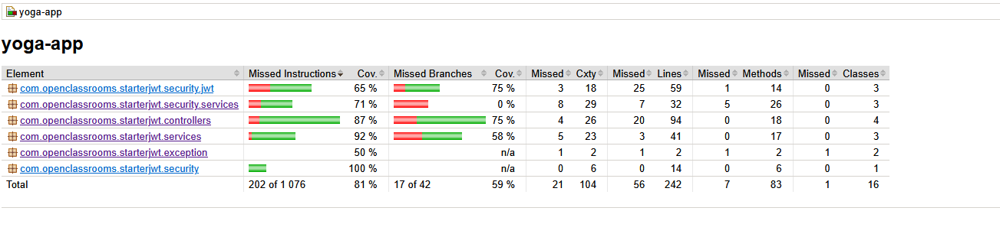

# Yoga App back

The Backend is based on Java11 using the SpringBoot Framework.

Backend tests:

- Jest for unit and integration tests
- Cypress for end-to-end tests

1. [Setup](#setup)
2. [Tests](#tests)
3. [Screenshots](#screenshots)

# Setup

## Prerequisites

- JDK 11
- Maven
- MySQL

## Install the application

### Clone the repository

```bash
git clone git@github.com:jceintrey/yoga-app.git
```

### Install dependencies

Go to the project folder

```bash
cd yoga-app
```

Install the project

```bash
cd back
mvn clean install
```

If there is a database connection error, the build will fail. You can skip the database access tests and come back to them later.

## Install and prepare the database

Once Mysql Server is installed, you have to configure a RW user for the application and adapt application.properties in back/src/main/resources/ to fit the databasename, username and password.
⚠️ you should use environment variables for password

```bash
create database test;
CREATE USER 'appuser'@'%' IDENTIFIED BY 'heresetastrongpassword';
GRANT ALL PRIVILEGES ON appuser.* TO 'appuser'@'%';
flush privileges;
```

## Running the application

To run the whole application, consider the Backend must be started before the front.

```bash
cd back
mvn spring-boot:run
```

# Tests

Backend tests are done using Junit5, Mockito and MockMVC.
Backend integration tests use H2 database.

### Run Unit tests

```bash
cd back
mvn clean test
```

### Run Unit and Integration tests and coverage reports

```bash
cd back
mvn clean verify
```

### Watch coverage reports

The coverage reports are separated:

- [Integration tests](http://127.0.0.1:5500/back/target/site/jacoco-integration/index.html)
- [Unit tests](http://127.0.0.1:5500/back/target/site/jacoco-unit/index.html)

# Screenshots

### Junit and Mockito unit tests (Back)



### Junit and MockMVC integration tests (Back)


