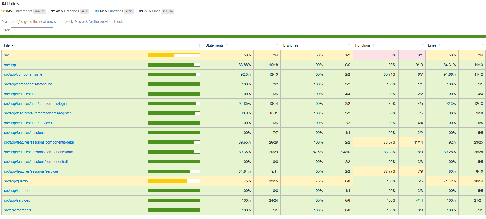
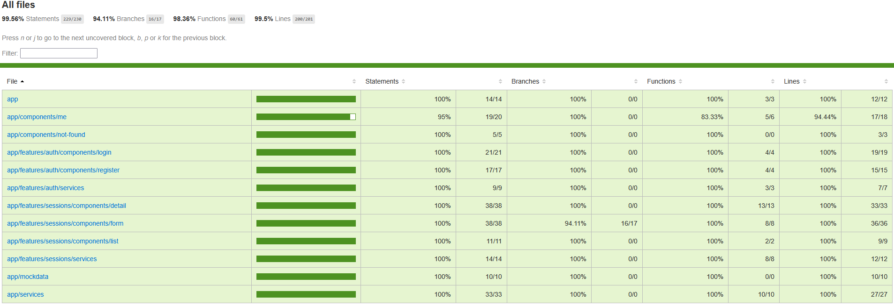

# Yoga App front

the Frontend is based on Angular version 14.

Frontend tests:

- Jest for unit and integration tests
- Cypress for end-to-end tests

1. [Setup](#setup)
2. [Tests](#tests)
3. [Screenshots](#screenshots)

# Setup

## Prerequisites

- Node.js v16
- Npm 7.5.x
- Angular 14

## Install the application

### Clone the repository

```bash
git clone git@github.com:jceintrey/yoga-app.git
```

### Install dependencies

Go to the project folder

```bash
cd yoga-app
```

Install the dependencies

```bash
cd front
npm i
```

## Running the application

To run the whole application, consider the Backend must be started before the front.

```bash
cd front
npm run start
```

# Tests

The tests are mocked. The Frontend and Backend tests can be done independently.

⚠️ Jest and Cypress start the Frontend, so do not start it before running the tests.

### Unit and integration tests

```bash
cd front
npm run test
```

And for coverage

```bash
npm run test:coverage
```

The HTML coverage report is generated in front/coverage/jest/lcov-report/, access index.html.  
[Jest Coverage Report](ressources/screenshots/front-unit-itg-coverage.png)  
An HTML test report is also available here: front/reports/test-report.html

Here is a summary with ratio

| Test File                   | Unit Tests | Integration Tests |
| --------------------------- | ---------- | ----------------- |
| register.component.spec.ts  | 2          | 1                 |
| auth.service.spec.ts        | 0          | 2                 |
| detail.component.spec.ts    | 2          | 4                 |
| form.component.spec.ts      | 3          | 3                 |
| list.component.spec.ts      | 1          | 0                 |
| session-api.service.spec.ts | 7          | 0                 |
| session.service.spec.ts     | 2          | 0                 |
| teacher.service.spec.ts     | 3          | 0                 |
| user.service.spec.ts        | 3          | 0                 |
| app.component.spec.ts       | 2          | 1                 |
| me.component.spec.ts        | 2          | 1                 |
| not-found.component.spec.ts | 1          | 0                 |
| login.component.spec.ts     | 2          | 1                 |
| **Sub total**               | **30**     | **13**            |
| **Ratio**                   | **70%**    | **30%**           |
| **Total**                   | **43**     |                   |

### End-to-end tests

```bash
cd front
npm run e2e:ci
```

And for the coverage report

```bash
npm run e2e:coverage
```

# Screenshots

### Cypress E2E Coverage (Front)



### Jest ITG Unit Coverage (Front)


